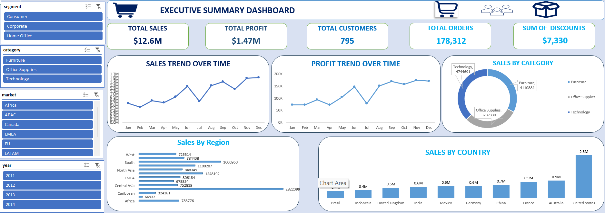
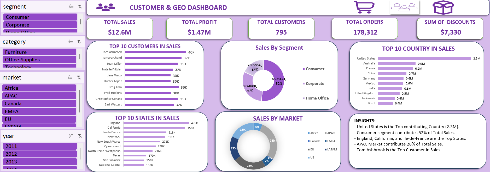
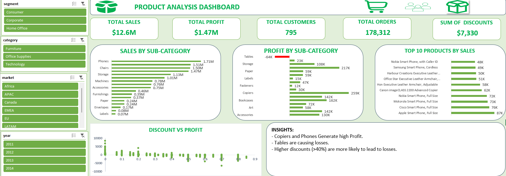

# Global E-Commerce Sales & Audience Analysis (Excel Dashboard)

## 📌 Project Overview
This project presents a dynamic 3-page interactive Excel Dashboard analyzing global e-commerce performance from 2011 to 2014. The analysis covers $12.6M in total sales across multiple segments, categories, and geographic markets.

## 📊 Interactive Dashboards

### 1. Executive Summary Dashboard

*High-level overview of Sales, Profit trends, and performance by region/country.*

### 2. Customer & Geo Dashboard

*Deep dive into customer segments, top buying countries, and individual top consumers.*

### 3. Product Analysis Dashboard

*Financial performance by category/sub-category, discount impacts, and top-selling products.*

## 💡 Key Insights Discovered
* **Top Market**: The United States is the primary revenue contributor, generating **$2.3M** in sales.
* **Core Segment**: Consumer retail represents the largest share, driving **52%** of total sales.
* **Profit Killers**: While Copiers and Phones yield high margins, the **Tables** sub-category is causing significant financial losses.
* **Discount Impact**: Offering discounts higher than **40%** shows a direct correlation with negative profitability.

## 🛠️ Tools & Features Used
* **Data Cleaning & Transformation**: Power Query / Excel Tables.
* **Data Aggregation**: Pivot Tables & Advanced Formulas.
* **Data Visualization**: Interactive Pivot Charts, Custom Slicers, Timeline filtering, and KPI cards.
* 
